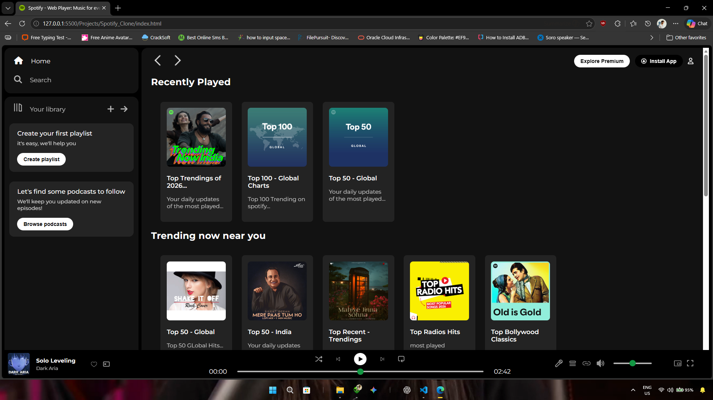
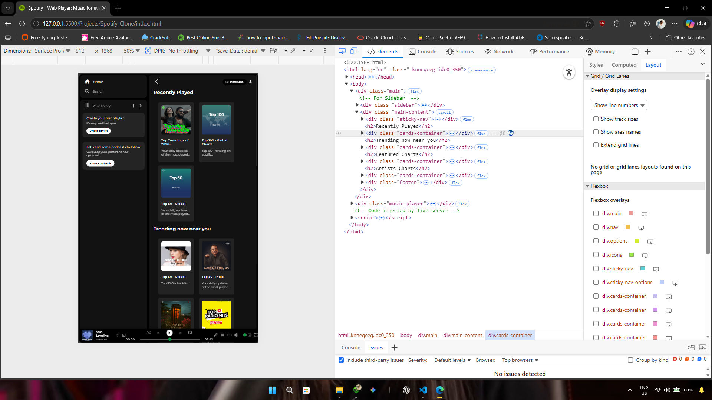
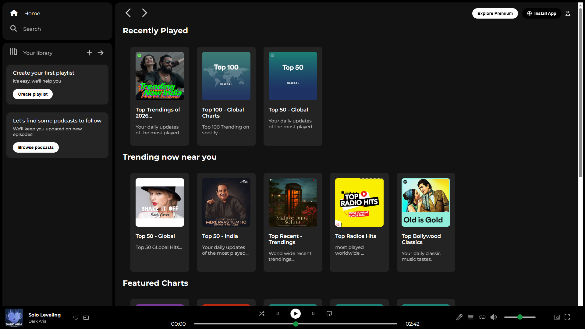

# 🎵 Spotify UI Clone

A modern Spotify-inspired frontend clone created using HTML and CSS.

---

## ✨ Features

- 🎧 Spotify-inspired modern UI
- 📱 Responsive layout
- 🖥️ Desktop view support
- 📲 Tablet view support
- 📺 Fullscreen layout
- 🎨 Clean dark theme interface

---

## 🛠️ Tech Stack

- HTML5
- CSS3

---

# 📸 Preview

## 🖥️ Desktop View


---

## 📱 Tablet View


---

## 📺 Fullscreen View


---

# 📂 Project Structure

```bash
Spotify_Clone/
│
├── Assets/
├── preview/
│   ├── desktop-view.png
│   ├── tablet-view.png
│   └── fullscreen-view.png
│
├── index.html
├── style.css
└── README.md
```

---

# 🎯 Purpose

This project was created for learning and practicing frontend web development skills using pure HTML and CSS.

---

# 👨‍💻 Author

Abhishek 
